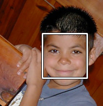

# OpenCVFaceDetection.jl



OpenCV based face detection in Julia

## Examples

```julia
using OpenCVFaceDetection
using OpenCV

# Load the built-in Haar cascade files if needed
loadcascades()

# Read an image and detect faces: returns vector of bounding boxes for detected faces
img = OpenCV.imread("groupphoto.jpg", OpenCV.IMREAD_GRAYSCALE)
faces = facedetect(img; biggest = true, min_neighbors = 5)

println("Detected $(length(faces)) face(s)")
for (x, y, w, h) in faces
    println("Face: x=$x, y=$y, width=$w, height=$h")
end

# Simple file input and output using the command interface with a vector of command strings
# The "-o" string indicates the next string in the vector is the output file name
# the last string, a name not preceded by an option, is by default the input file name
facedetect(["-o", "detectedfaces.png", "groupphoto.jpg"])

# The /bin directory has the executable for the command-line interface of the face detection tool.
# Use it like this at command line (may need to be renamed with .cmd for Windows):
# ./bin/facedetect -o detectedfaces.png groupphoto.jpg

# Another example: this returns (equalized_image, detected_faces)
img, faces = facedetect("groupphoto.jpg"; biggest = true)

println("Detected $(length(faces)) face(s)")
for (x, y, w, h) in faces
    println("Face: x=$x, y=$y, width=$w, height=$h")
end


# And if you want a visual example, with use of OpenCV display functions:

using OpenCVFaceDetection
using OpenCV

loadcascades() # Call before using facedetect, to set up the CASCADES dict. Downloads data if missing.

# Manual image handling: facedetect's size filtering assumes a single-channel image,
# so detect on grayscale and draw onto a new color copy for display/output.

img_gray = OpenCV.imread("groupphoto.jpg", OpenCV.IMREAD_GRAYSCALE)
img = OpenCV.imread("groupphoto.jpg")
faces = facedetect(img_gray; biggest = false, min_neighbors = 5)

for (x, y, w, h) in faces
    p1 = OpenCV.Point{Int32}(Int32(x), Int32(y))
    p2 = OpenCV.Point{Int32}(Int32(x + w), Int32(y + h))
    OpenCV.rectangle(img, p1, p2, (0, 255, 255); thickness = 2)
end

OpenCV.imwrite("faces_detected.jpg", img)
OpenCV.imshow("Detected Faces", img)
OpenCV.waitKey(0)
OpenCV.destroyAllWindows()

```


## Installation
```julia
using Pkg
Pkg.add("OpenCVFaceDetection")
```

## Functions Reference


```@index
```

```@autodocs
Modules = [OpenCVFaceDetection]
```
